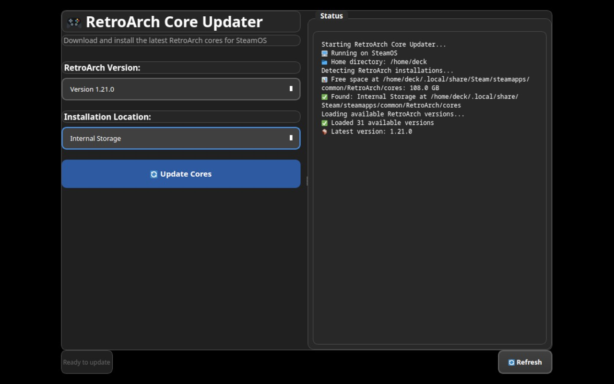

# RetroArch Core Updater for SteamOS

*Transform your RetroArch experience with a user-friendly interface that works seamlessly in both desktop and game modes.*



I have seen many users on the Steam Deck forums on Reddit and elsewhere relying on the Flatpak version of RetroArch from the Discover Store due to the core availability over the Steam version, and the Steam version relying on it's DLC. 

This application will simplify that process for end-users, because ☁️STEAM CLOUD SAVES☁️ are more beneficial than just about anything!

### 🖱️ **Modern GUI Interface**
- Touch-friendly two-column layout optimized for Steam Deck & Handheld PC's running SteamOS
- Dark theme with Steam game mode compatibility
- Integrated progress tracking
- No terminal or command-line knowledge required

### 📦 **Easy Updates**
- One-click downloading of RetroArch cores for any version
- Version selector with all available Libretro releases
- Real-time progress tracking with detailed status log

## How to use this script
- On your Steam Deck, switch to Desktop Mode and download the Bash script `update_RA_cores.sh` from this repository
- By default, this should download to your Downloads folder at `/home/deck/Downloads`
- Right-click on the file in Dolphin (default File Explorer)-> Properties
- Click on the `Permissions` tab, and ensure that you select the checkbox next to `Is Executable` -> click `OK`

### ⚡ **Steam Deck Optimized**
- Works perfectly in both desktop mode and game mode
- Supports both internal storage and SD card installations
- Preserves Steam Cloud Save compatibility

### Quick Start (Recommended)

1. **Download** the latest `RetroArch-Core-Updater-x86_64.AppImage` from the [Releases page](../../releases)

2. **Launch the application** by double-clicking the AppImage or running:
   ```bash
   ./RetroArch-Core-Updater-x86_64.AppImage
   ```

### Add to Steam Library (Optional)

To launch from Steam in game mode:

1. Switch to **Desktop Mode**
2. **Right-click** the AppImage → **Add to Steam**
3. In Steam, go to your **Library** → **Non-Steam** games
4. Find "RetroArch Core Updater" and launch it

*The application works perfectly in both desktop mode and Steam Deck game mode.*

## Usage

1. **Select RetroArch version** from the dropdown menu
   - All available Libretro versions are listed
   - Latest version (1.21.0+) is recommended

2. **Choose installation location**
   - App automatically detects your RetroArch installations
   - Supports both internal storage and SD card paths

3. **Click "🔄 Update Cores"**
   - Progress is shown in the integrated status panel
   - Detailed logging of all operations
   - Safe to cancel at any time

## What This App Does

1. **Backs up** your existing cores for safety
2. **Downloads** the latest core information from Libretro
3. **Fetches** the RetroArch cores package for your selected version
4. **Extracts** and installs cores to your RetroArch directory
5. **Cleans up** temporary files and validates the installation

## Benefits Over Manual Methods

- ✅ **No installation required** - portable AppImage runs anywhere
- ✅ **No terminal commands** - everything is point-and-click
- ✅ **Steam game mode compatible** - works perfectly in handheld mode
- ✅ **Automatic backups** - your existing setup is preserved
- ✅ **Integrated progress tracking** - no popup dialogs or interruptions
- ✅ **Error recovery** - intelligent handling of failed downloads
- ✅ **Version management** - easily switch between any RetroArch version
- ✅ **Self-contained** - all dependencies bundled, no system conflicts
- ✅ **Steam Cloud compatibility** - maintains your cloud save functionality

## System Requirements

- **Steam Deck** (or any modern Linux system)
- **RetroArch installed** via Steam or other method
- **Internet connection** for downloading cores
- **FUSE2 support** (pre-installed on Steam Deck)
  - If FUSE2 unavailable, AppImage will extract-and-run automatically

## Development

For developers who want to build the AppImage from source:

### Prerequisites

- **Python 3.10+** 
- **UV** package manager (install from [astral-sh/uv](https://github.com/astral-sh/uv))
- **Git** for cloning the repository
- **AppImageTool** for creating the final AppImage

## Building the AppImage Directly

1. **Create AppImage directory structure:**
   ```bash
   mkdir -p RetroArch-Core-Updater.AppDir/opt/app
   mkdir -p RetroArch-Core-Updater.AppDir/usr/lib/python3/site-packages
   mkdir -p RetroArch-Core-Updater.AppDir/usr/share/icons/hicolor/128x128/apps
   mkdir -p RetroArch-Core-Updater.AppDir/usr/share/applications
   ```

2. **Install Python dependencies to AppImage:**
   ```bash
   # Install dependencies only (not the app itself)
   uv pip install --target RetroArch-Core-Updater.AppDir/usr/lib/python3/site-packages PySide6>=6.5.0 requests>=2.31.0
   ```

3. **Copy application source and create proper AppImage structure:**
   ```bash
   # Copy source code directory (preserves import structure)
   cp -r src RetroArch-Core-Updater.AppDir/opt/app/
   
   # Copy icon to AppDir root
   cp assets/retroarch-core-updater.png RetroArch-Core-Updater.AppDir/
   cp assets/retroarch-core-updater.png RetroArch-Core-Updater.AppDir/usr/share/icons/hicolor/128x128/apps/   
   ```

4. **Create AppImage structure files:**

   **Create the AppRun launcher script:**
   ```bash
   cat > RetroArch-Core-Updater.AppDir/AppRun << 'EOF'
   #!/bin/bash
   
   # AppImage entry point for RetroArch Core Updater
   HERE="$(dirname "$(readlink -f "${0}")")"
   
   # Add our Python packages to the path
   export PYTHONPATH="${HERE}/usr/lib/python3/site-packages:${HERE}/opt/app:${PYTHONPATH}"
   
   # Add system libraries to path
   export LD_LIBRARY_PATH="${HERE}/usr/lib:${LD_LIBRARY_PATH}"
   
   # Change to app directory to ensure relative paths work
   cd "${HERE}/opt/app"
   
   # Run our Python application directly
   exec python3 "${HERE}/opt/app/src/main.py" "$@"
   EOF
   ```

   **Make the launcher script executable**
   ```bash
   chmod +x RetroArch-Core-Updater.AppDir/AppRun
   ```

   **Create the desktop file:**
   ```bash
   cat > RetroArch-Core-Updater.AppDir/retroarch-core-updater.desktop << 'EOF'
   [Desktop Entry]
   Name=RetroArch Core Updater
   GenericName=RetroArch Core Manager
   Comment=Download and install RetroArch cores for Steam Deck
   Keywords=retroarch;emulator;cores;steam;deck;gaming;
   Exec=retroarch-core-updater
   Icon=retroarch-core-updater
   Terminal=false
   Type=Application
   Categories=Game;Emulator;Utility;
   StartupNotify=true
   EOF
   ```

   **Copy desktop file to system applications directory**
   ```bash
   cp RetroArch-Core-Updater.AppDir/retroarch-core-updater.desktop RetroArch-Core-Updater.AppDir/usr/share/applications/
   ```

5. **Download AppImageTool for building the AppImage:**
   ```bash
   wget -O appimagetool https://github.com/AppImage/AppImageKit/releases/download/continuous/appimagetool-x86_64.AppImage && \
   chmod +x appimagetool
   ```

6. **Lastly, Build the RetroArch-Core-Updater AppImage**
   ```bash
   ARCH=x86_64 ./appimagetool --appimage-extract-and-run RetroArch-Core-Updater.AppDir RetroArch-Core-Updater-x86_64.AppImage
   ```

### Source Development Setup

1. **Clone the repository:**
   ```bash
   git clone https://github.com/your-repo/steam-deck-ra-core-updater.git
   cd steam-deck-ra-core-updater
   ```

2. **Set up development environment with UV:**
   ```bash
   uv venv
   source .venv/bin/activate  # Linux/Mac
   # or .venv\Scripts\activate  # Windows
   uv pip install -e .
   ```

   *This installs all dependencies defined in `pyproject.toml` including PySide6 and requests.*

3. **Run from source for testing:**
   ```bash
   python src/main.py
   ```

### Project Structure

The project uses modern Python packaging with:
- **pyproject.toml** - Contains all project metadata, dependencies, and build configuration
- **src/ layout** - Modern Python project structure with source code in dedicated directory  
- **UV package manager** - For faster, more reliable dependency management

### Why UV?

We use UV instead of pip because it offers:
- **Faster dependency resolution** and installation
- **Better conflict detection** and resolution
- **More reliable builds** with consistent environments
- **Modern Python packaging** standards with full pyproject.toml support

## Legacy Script

The original bash script (`update_RA_cores.sh`) is still available for advanced users who prefer command-line tools. However, the new GUI application provides a much better user experience for most users.

## Support

For help and support:
- Report issues on [GitHub Issues](../../issues)

## Contributing

We welcome contributions! See [CONTRIBUTING.md](CONTRIBUTING.md) for guidelines.

## License

This project is licensed under the MIT License - see the [LICENSE](LICENSE) file for details.
